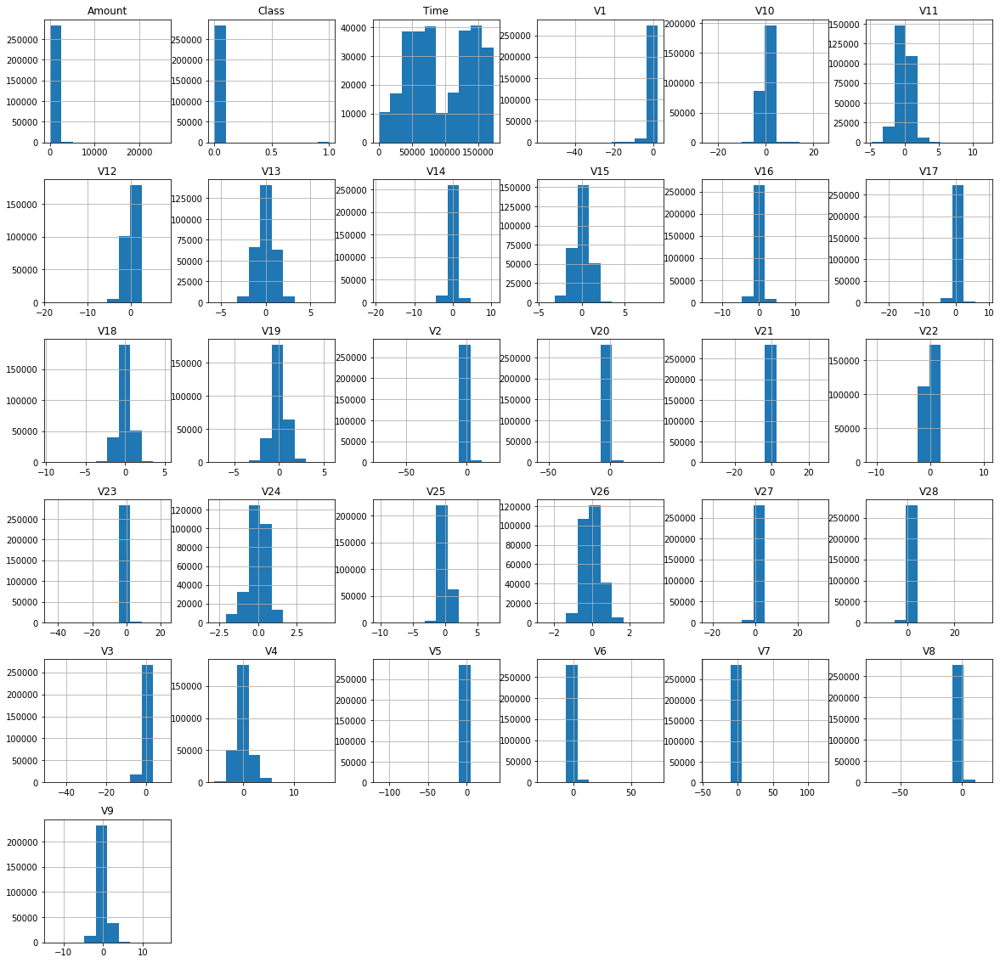
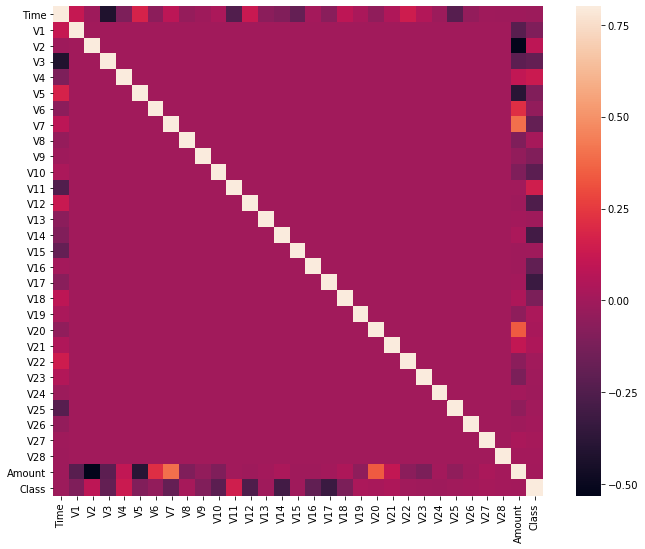

```python
import sys 
import numpy
import pandas 
import matplotlib 
import seaborn 
import scipy
import sklearn


print('Python: {}'.format(sys.version))
print('Numpy: {}'.format(numpy.__version__))
print('Pandas: {}'.format(pandas.__version__))
print('MatPlotLib: {}'.format(matplotlib.__version__))
print('Seaborn: {}'.format(seaborn.__version__))
print('SciPy: {}'.format(scipy.__version__))
print('SkLearn: {}'.format(sklearn.__version__))

import numpy as np 
import pandas as pd 
import matplotlib.pyplot as plt 
import seaborn as sns
```

    Python: 3.7.5 (default, Nov  1 2019, 02:16:38) 
    [Clang 10.0.0 (clang-1000.11.45.5)]
    Numpy: 1.17.4
    Pandas: 0.25.3
    MatPlotLib: 3.1.2
    Seaborn: 0.9.0
    SciPy: 1.3.3
    SkLearn: 0.22


```python
# load dataset from the csv file using pandas

data = pd.read_csv('creditcard.csv')
```


```python
# explore the data
print(data.columns)
```

    Index(['Time', 'V1', 'V2', 'V3', 'V4', 'V5', 'V6', 'V7', 'V8', 'V9', 'V10',
           'V11', 'V12', 'V13', 'V14', 'V15', 'V16', 'V17', 'V18', 'V19', 'V20',
           'V21', 'V22', 'V23', 'V24', 'V25', 'V26', 'V27', 'V28', 'Amount',
           'Class'],
          dtype='object')


```python
print(data.shape)
```

    (284807, 31)


```python
print(data.describe())
```

                    Time            V1            V2            V3            V4  \
    count  284807.000000  2.848070e+05  2.848070e+05  2.848070e+05  2.848070e+05   
    mean    94813.859575  1.165980e-15  3.416908e-16 -1.373150e-15  2.086869e-15   
    std     47488.145955  1.958696e+00  1.651309e+00  1.516255e+00  1.415869e+00   
    min         0.000000 -5.640751e+01 -7.271573e+01 -4.832559e+01 -5.683171e+00   
    25%     54201.500000 -9.203734e-01 -5.985499e-01 -8.903648e-01 -8.486401e-01   
    50%     84692.000000  1.810880e-02  6.548556e-02  1.798463e-01 -1.984653e-02   
    75%    139320.500000  1.315642e+00  8.037239e-01  1.027196e+00  7.433413e-01   
    max    172792.000000  2.454930e+00  2.205773e+01  9.382558e+00  1.687534e+01   
    
                     V5            V6            V7            V8            V9  \
    count  2.848070e+05  2.848070e+05  2.848070e+05  2.848070e+05  2.848070e+05   
    mean   9.604066e-16  1.490107e-15 -5.556467e-16  1.177556e-16 -2.406455e-15   
    std    1.380247e+00  1.332271e+00  1.237094e+00  1.194353e+00  1.098632e+00   
    min   -1.137433e+02 -2.616051e+01 -4.355724e+01 -7.321672e+01 -1.343407e+01   
    25%   -6.915971e-01 -7.682956e-01 -5.540759e-01 -2.086297e-01 -6.430976e-01   
    50%   -5.433583e-02 -2.741871e-01  4.010308e-02  2.235804e-02 -5.142873e-02   
    75%    6.119264e-01  3.985649e-01  5.704361e-01  3.273459e-01  5.971390e-01   
    max    3.480167e+01  7.330163e+01  1.205895e+02  2.000721e+01  1.559499e+01   
    
           ...           V21           V22           V23           V24  \
    count  ...  2.848070e+05  2.848070e+05  2.848070e+05  2.848070e+05   
    mean   ...  1.656562e-16 -3.444850e-16  2.578648e-16  4.471968e-15   
    std    ...  7.345240e-01  7.257016e-01  6.244603e-01  6.056471e-01   
    min    ... -3.483038e+01 -1.093314e+01 -4.480774e+01 -2.836627e+00   
    25%    ... -2.283949e-01 -5.423504e-01 -1.618463e-01 -3.545861e-01   
    50%    ... -2.945017e-02  6.781943e-03 -1.119293e-02  4.097606e-02   
    75%    ...  1.863772e-01  5.285536e-01  1.476421e-01  4.395266e-01   
    max    ...  2.720284e+01  1.050309e+01  2.252841e+01  4.584549e+00   
    
                    V25           V26           V27           V28         Amount  \
    count  2.848070e+05  2.848070e+05  2.848070e+05  2.848070e+05  284807.000000   
    mean   5.340915e-16  1.687098e-15 -3.666453e-16 -1.220404e-16      88.349619   
    std    5.212781e-01  4.822270e-01  4.036325e-01  3.300833e-01     250.120109   
    min   -1.029540e+01 -2.604551e+00 -2.256568e+01 -1.543008e+01       0.000000   
    25%   -3.171451e-01 -3.269839e-01 -7.083953e-02 -5.295979e-02       5.600000   
    50%    1.659350e-02 -5.213911e-02  1.342146e-03  1.124383e-02      22.000000   
    75%    3.507156e-01  2.409522e-01  9.104512e-02  7.827995e-02      77.165000   
    max    7.519589e+00  3.517346e+00  3.161220e+01  3.384781e+01   25691.160000   
    
                   Class  
    count  284807.000000  
    mean        0.001727  
    std         0.041527  
    min         0.000000  
    25%         0.000000  
    50%         0.000000  
    75%         0.000000  
    max         1.000000  
    
    [8 rows x 31 columns]


```python
# sampling dataset
# data = data.sample(frac = 0.1, random_state = 1)
# print(data.shape)
```

    (28481, 31)


```python
# plot histogram of each parameter

data.hist(figsize = (20,20))
plt.show()
```





```python
# determine number of fraud cases in dataset
Fraud = data[data['Class'] == 1]
Valid = data[data['Class'] == 0]

outlier_fraction = len(Fraud) / float(len(Valid))
print(outlier_fraction)

print('Fraud Cases: {}'.format(len(Fraud)))
print('Valid Cases: {}'.format(len(Valid)))
```

    0.0017304750013189597
    Fraud Cases: 492
    Valid Cases: 284315


```python
# correlation matrix
cormat = data.corr()
fig = plt.figure(figsize = (12,9))

sns.heatmap(cormat, vmax = .8, square = True)
```


    <matplotlib.axes._subplots.AxesSubplot at 0x12539d810>





```python
# get all the columns from the DataFrame
columns = data.columns.tolist()

# filter the columns to remove data we do not want
columns = [c for c in columns if c not in ["Class"]]

# store the variables we'll be predicting on
target = "Class"

X = data[columns]
Y = data[target]

# print the shapes of X and Y
print(X.shape)
print(Y.shape)

```

    (284807, 30)
    (284807,)


```python

from sklearn.metrics import classification_report, accuracy_score
from sklearn.ensemble import IsolationForest
from sklearn.neighbors import LocalOutlierFactor 

# anomaly detection methods
# Isolation Forest
# Local Outlier Factor

# define a random state
state = 1

# define the outlier detection methods
classifiers = {
    "Isolation Forest": IsolationForest(max_samples=len(X),
                                        contamination = outlier_fraction,
                                        random_state = state),
    "Local Outlier Factor": LocalOutlierFactor(
        n_neighbors = 20,
        contamination = outlier_fraction)
}
```


```python
# fit the model 
n_outliers = len(Fraud)

for i, (clf_name, clf) in enumerate(classifiers.items()):
    # fit the data and tag outliers
    if clf_name == "Local Outlier Factor":
        y_pred = clf.fit_predict(X)
        scores_pred = clf.negative_outlier_factor_
    else:
        clf.fit(X)
        scores_pred = clf.decision_function(X)
        y_pred = clf.predict(X)

    # reshape the prediction values to 0 for valid, 1 for fraud
    y_pred[y_pred == 1] = 0
    y_pred[y_pred == -1] = 1

    n_errors = (y_pred != Y).sum()

    # run classification metrics
    print('{}: {}'.format(clf_name, n_errors))
    print(accuracy_score(Y, y_pred))
    print(classification_report(Y, y_pred))
```

    Isolation Forest: 645
    0.997735308472053
                  precision    recall  f1-score   support
    
               0       1.00      1.00      1.00    284315
               1       0.34      0.35      0.35       492
    
        accuracy                           1.00    284807
       macro avg       0.67      0.67      0.67    284807
    weighted avg       1.00      1.00      1.00    284807
    
    Local Outlier Factor: 935
    0.9967170750718908
                  precision    recall  f1-score   support
    
               0       1.00      1.00      1.00    284315
               1       0.05      0.05      0.05       492
    
        accuracy                           1.00    284807
       macro avg       0.52      0.52      0.52    284807
    weighted avg       1.00      1.00      1.00    284807
    

